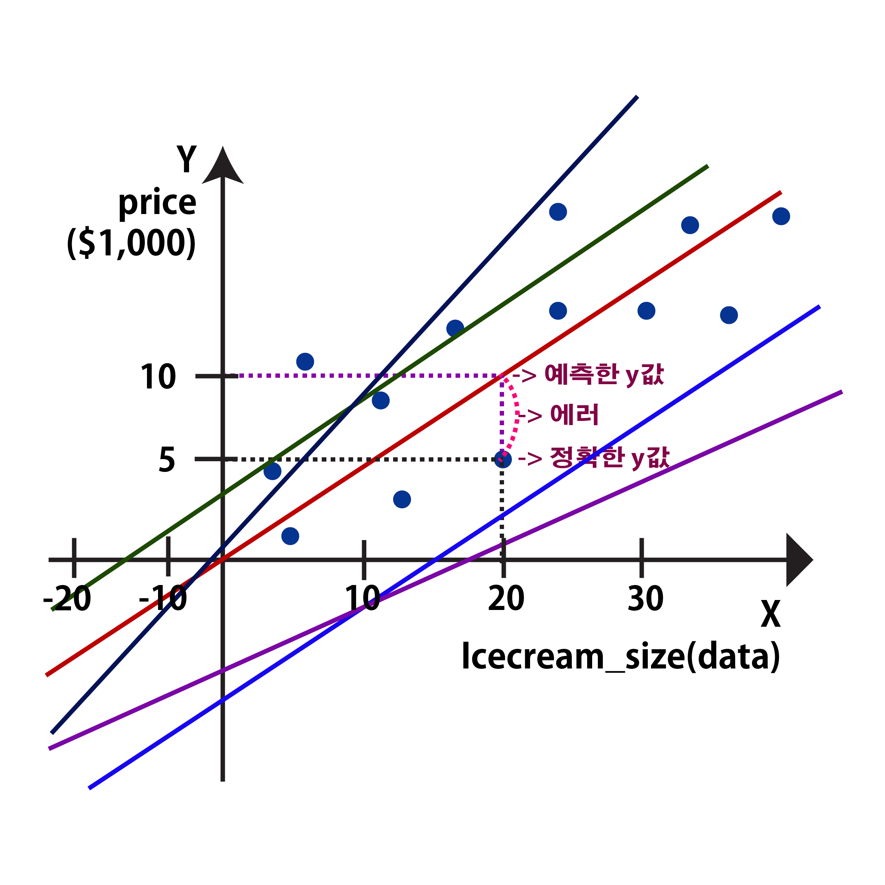

# 01. `모델(Model)`이란?

## 01) $y=b+a_x$ = 이 수식은 `모델(Model)`을 나타냄
- $h_o(x)=\theta_0 + \theta_1x$

    - $h_o(x)$는 `모델의 에측값(표기법)`을 나타내면서 x값이 들어간 것을 말한다.
    - $\theta_0$은 `편향(bias)`
    - $\theta_1$은 `가중치, 보정치`
    - $x$는 `데이터(열)`