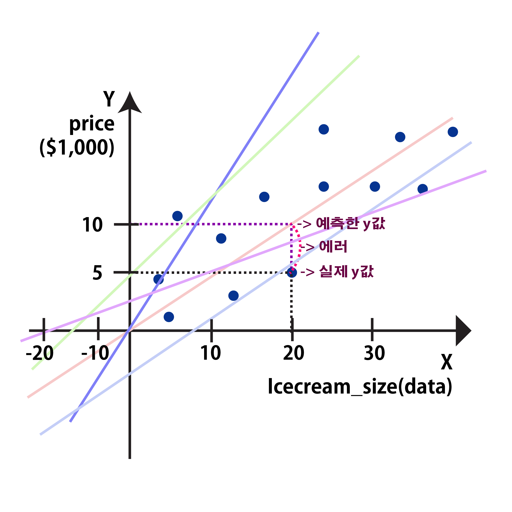

# 01. `모델(Model)`이란?
 
- 통계학 모형에서 유래 : x가 들어가서 계산한 다음에 y라는 결과가 나오는 구조
- 데이터를 설명할 수 있는 것
- $y=a_x+b$ 이다.
- $a$과 $b$를 (모델의) Parameter, $\theta$(쎄타)라고 한다.

---
|이름|설명|
|--|--|
|$y$|(모델의) 예측값|
|$a$|기울기|
|$_x$|데이터|
|$b$|y절편|
---

# 02. `학습(Learning)`이란?
- 내 데이터에 맞는 모델을 찾는 과정
- 모델 적합(`Model fitting`)이라고도 한다.
---

## 01) 데이터를 가장 잘 설명하는 모델을 어떻게 찾는가?
- 가설 모델에 데이터를 넣어서 결과를 `평가`한다.
- 결과를 개선하기 위해 모델을 `수정`한다.

## 02) $y=b+a_x$
- $h_o(x)=\theta_0 + \theta_1x$ 이다.
  - $h_o(x)$는 `모델의 예측값(표기법)`을 나타내면서 x값이 들어간 것을 말한다.
  - $\theta_0$은 `편향(bias)`
  - $\theta_1$은 `가중치, 보정치`
  - $x$는 `데이터(열)`
  - $a$는 `기울기`, `(모델의) Parameter` 
  - $b$는 `y절편`, `(모델의) Parameter`

