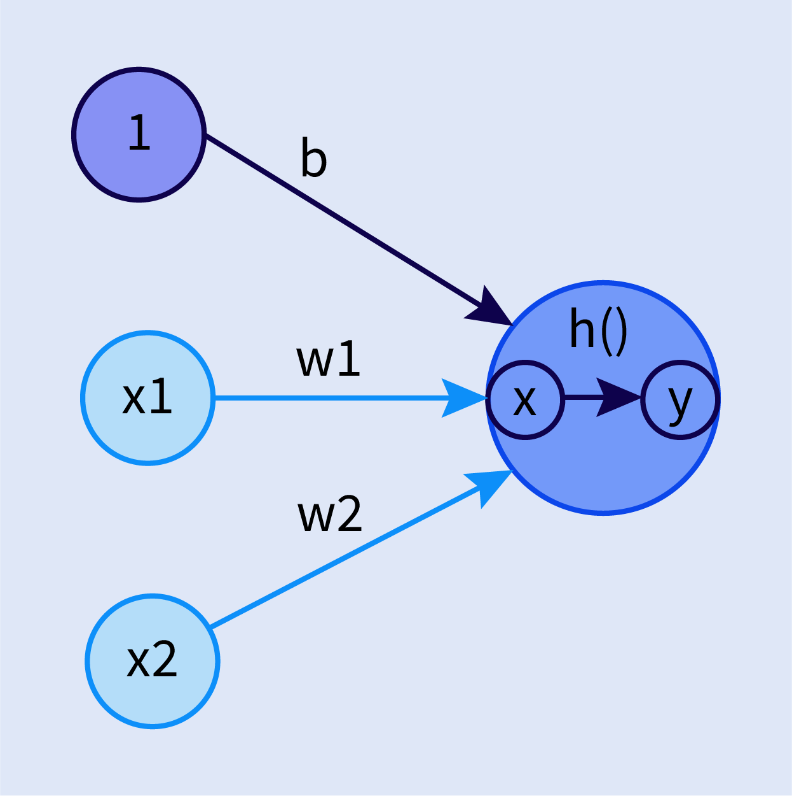

# 활성화 함수(Activation function)

## 1. 활성화 함수(Activation function) 의미
- 정보가 활성화되는지 혹인 정보가 활성화된다면, 어떻게 활성화되어 출력 값을 생성해내는지를 결정하는 것을 의미한다.

## 2. 퍼셉트론에서 활성화 함수가 적용된 방법

$h(x)=\begin{cases} 
0 \\\ (x\leq0)\\ 
1 \\\ (x>0) 
\end{cases}$

- 이 수식에서 퍼셉트론 수식의 결과인 $x$는 활성화 함수 $h(x)$에 들어가게 되고, 그 결과는 출력 값인 $y$로 나온다.

- 네이비 노드는 편향값이던 $b$를 노드와 동일한 형태로 만들어서 $b, w_1, w_2$ 모두 가중치라고 해도 좋다.
- 각 노드 1, $x_1, x_2$는 각각 $b, w_1, w_2$를 가중치로 받아 곱해지고, $x$로 합산되어 나온다.
- 합산된 $x$는 활성화 함수 $h(x)$가 되어 출력값인 $y$가 최종적으로 도출되게 된다.