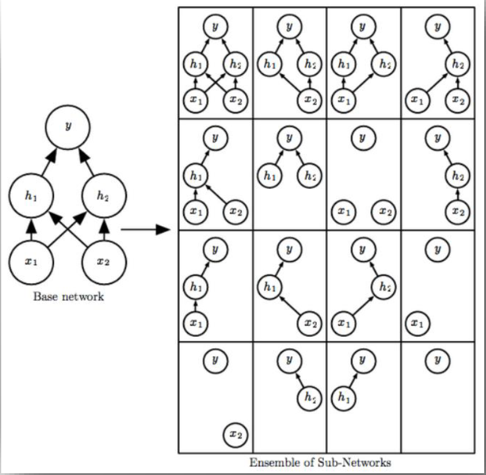
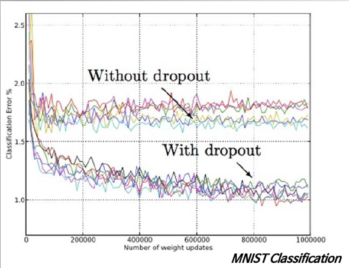
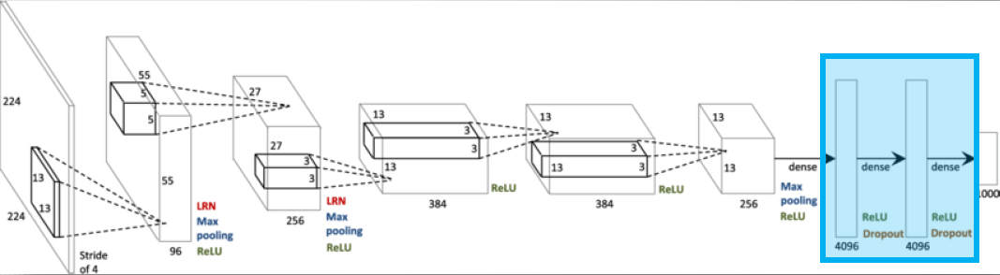
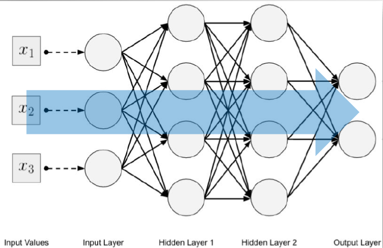

`# 1. Avoiding overfitting

## 1. Dropout (2012, Geoffrey Hinton)
- 신경망에 적용할 수 있다.
- Batch마다 Layer단위로 일정 비율만큼 Neuron을 끄는 방식이다.
- 주의해야 할 점은 Test / Inference 단계에서는 Dropout을 하지 않고, 전체 Neuron가지고 진행해야 한다.
- 출력이 가까울수록 더 큰 특징을 알 수 있다.
- train data를 줄일 수 있다.

## example
- 예를 들어서 고양이 이미지를 10 * 10 으로 100개 퍼셉트로 만들어서 이미지 구조를 파악한 후(고양이 눈, 코, 입) 그 이미지가 어떤 이미지에 접근한 것인지는 알 수 있다.

- 예를 들어서 고양이 사진 1장만 학습했을 때 잘 맞출 수 있지만 갑자기 길 고양이 사진을 가지고 학습하면 고양이가 아니라고 판단할 수 있다. 이 때 고양이 이미지를 몇 개만 dropout하면 학습속도가 빨라지고, 학습효과를 높일 수 있다.
- dropout 예를 들자면 고양이 이미지를 눈, 입만 보여주고, 코, 꼬리는 안 보여주는 것을 의미한다.
- dropout하면 고양이 사진 1장을 학습했을 때 바로 고양이라고 맞추는 것과 비슷한 효과를 얻을 수 있다.

## 위에 있는 그림 설명

- $x$, $h$ = 2
- $h_1$, $h_2$, $x_1$, $x_2$ = 4
- $2^4=16$ 이 나온다.
- 16은 16가지 경우의 수를 의미한다.
- 16가지 경우의 수를 Dropout를 적용해서 나온 결과이다.
- Dropout하면 성능은 조금 떨어지지만 서로 다른 모델들을 적용이 가능하고, overfitting 나타나는 것을 줄일 수 있다.
  

## 위에 있는 그림 설명

## With dropout 그래프
- without dropout은 드랍아웃을 적용하지 않는 것을 의미한다.
- with dropout은 드랍아웃 적용한 것을 의미한다.
- x는 모델학습을 의미한다.
- y는 에러를 의미한다.

## dropout 요약
- 전반적으로 Overfitting을 줄여주는 효과를 가지고 있다.
- Test data에 대한 에러를 더욱 낮출 수 있다.
- 가중치 값이 큰 특정 Neuron의 영향력이 커져서 다른 Neuron들의 학습 속도에 문제를 발생시키는 Co-adaptation을 회피할 수 있다.

## dropout 사용하는 방법

## 위에 있는 그림 설명

- 이 그림은 Alexnet이 인공신경망을 도식화한 그림이다.
- 2012년도 ImageNet Challenge에서 우승한 Alexnet은 마지막 개의 Fully-connected layer(파란색 네모)에 Dropout을 적용하였다. (p==0.5)
- 그림을 보면 파란 네모에서 이미지 데이터를 4,096그림으로 줄인 것을 볼 수 있다.
- Alexnet 이미지 데이터를 4,096그림으로 줄인 이유는 이미지 데이터가 성능이 뛰어나고, overfitting을 줄일 수 있기 때문이다.

## 2. Batch Normalization (2015)
- 데이터 내 Column들의 Scale에 Model이 너무 민감해지는 것을 막아줌으로써 Input data에 대해 Standardization과 같은 Normalization을 적용하면 전반적으로 Model 성능이 높아지는 것이다.
- 신경망의 경우 Normalization이 제대로 적용되지 않으면 최적의 cost지점으로 가는 길을 빠르게 찾지 못한다.
- x데이터에 있는 열 데이터가 맞추어지지 않으면 $\theta_1$, $\theta_2$에 있는 scaling(데이터 전처리)에 영향을 받는다. (Feature error발생)
- 따라서 x데이터에 Standardization과 같은 Normalization 해서 x데이터 scaling(데이터 전처리)에 적용을 하면 model의 성능이 높아진다.
- 그 뿐만이 아니라 학습속도이 빨라지고, 학습성능도 높아진다.
- Batch Normalization을 하면 L1, L2 필요성이 느껴지지 않는다.
- Standardization과 같은 모델은 Input data뿐만 아니라 신경망 내부의 중간에 있는 Hidden layer로의 input로의 input에도 적용하는 것이 Batch Normalization이다.
- 참고로 Activation function을 적용하기 전에 Batch normalization을 먼저 적용한다. (앞과 뒤 중 어느 곳에 삽입할지는 논의/실험 중이다.)

## 위에 있는 그림 설명

- Input Layer : 100행 3열(100 * 3) x데이터(원본 데이터)
- 여기서 Standardization 적용하면 학습 성능이 높아지고, 학습 효과가 빨라진다.
- Hidden Layer1 : 3행 4열 행렬곱
- Hidden Layer2 : 100행 4열, Hidden Layer입구에 파도처럼 밀려 들어오는 새로운 x데이터가 생성
- 새로운 x데이터에도 Standardization을 적용한다.
- 참고로 Standardization을 중간중간에 적용하면 학습효과가 빨라지고, 학습 성능이 높아진다.

