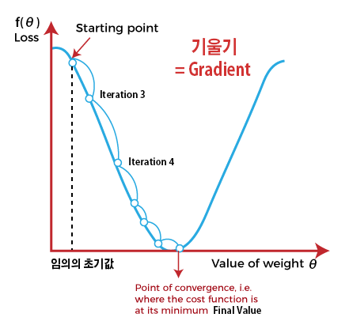

# 1. Gradient Descent Algorithm(경사 하강법)

- Gradient(기울기): 모든 변수의 편미분을 백터로 정리한 것
- 편미분 : 변수가 2개 이상인 함수를 미분할 때 `미분 대상 변수 외에 나머지 변수를 상수처럼 고정시켜 미분`하는 것
- 1 변수($\theta$)의 초기값을 설정
- 2 현재 변수에 대응되는 Cost function의 경사도 계산(미분)
- 3 변수를 경사 방향(기울기의 음의 방향 = Gradient의 음의 방향)으로 움직여 다음 변수 값으로 설정
- 1 ~ 3을 반복하여 Cost function이 최소가 되도록 하는 변수 값으로 근접해 나간다. (이 때 전체 Cost값이 변하지 않거나 매우 느리게 변할 때까지 접근한다.)

