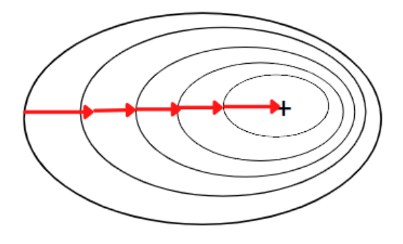
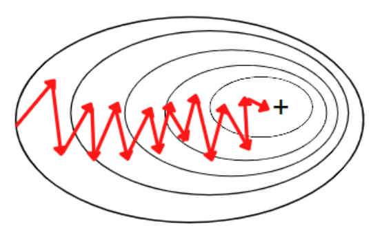

# 1. Gradient Descent Algorithm(경사 하강법)
## 1. 정의

- 모델 파라미터가 무작위하게 초기화가 된 후 반복적으로 수정되어 비용 함수(Cost Function)를 최소화한다.
- 학습 스텝 크기는 비용 함수(Cost Function)의 가울기(Gradient)에 비례한다.
- 따라서 파라미터가 최솟값에 가까워질수록 스텝 크기가 점진적으로 줄어든다.
- 경사 하강법에서 중요한 파라미터는 스텝(반복적인 학습 알고리즘에서 학습의 각 단계를 표현)의 크기이다.

## 2. 그래프

- 1 변수($\theta$)의 초기값을 무작위로 설정한다.
- 2 현재 변수에 대응되는 Cost function의 경사도 계산(미분)한다.
- 3 변수를 경사 방향(기울기의 음의 방향 = Gradient의 음의 방향)으로 움직여 다음 변수 값으로 설정한다.
- 1 ~ 3을 반복하여 Cost function이 최소가 되도록 하는 변수 값으로 근접해 나간다. (이 때 전체 Cost값이 변하지 않거나 매우 느리게 변할 때까지 접근한다.)

## 3. 수식 
## $\theta_j$ := $\theta_j$  - $a\frac{\partial}{\partial\partial_j}j(\theta_0$, $\theta_1$)

- 수식에서 맨 앞에 있는 $\theta_j$는 new $\theta$이다.
- 그 뒤에 있는 $\theta_j$는 old $\theta$이다.
- $a$는 학습률(Learnig rate)이다.
- 학습률(Learning rate)은 얼마나 큰 보폭으로 움직일지를 결정해 주는 값이다.
- $\frac{\partial}{\partial\partial_j}j(\theta_0$, $\theta_1$)는 기울기(Gradient)이다.

## 4. 핵심

- 경사 하강법에서 중요한 파라미터는 스텝(반복적인 학습 알고리즘에서 학습의 각 단계를 표현)의 크기로 학습률(Learning rate) 하이퍼 파라미터(Hyper parameter)로 결정된다.
- 학습률(Learnig Rate)이 너무 작으면 알고리즘이 수렴하기 위해 반복을 많이 진행해야 하므로 시간이 오래 걸린다.
- 학습률(Learning Rate)이 너무 크면 골짜기를 가로질러 반대편으로 건너뛰게 되면서 알고리즘을 더 큰 값으로 발산하게 만들어 최솟값(mininum)에 도달하지 못 하게 된다.
- 비용 함수(Cost Function)를 최소화하는 모델 파라미터의 조합을 찾는 것이 가장 중요하다.
- 모델 파라미터의 조합을 찾았을 때 경사 하강법 알고리즘이 곧바로 최솟값(mininum)으로 빠르게 도달할 수 있다.
- 만약에 파라미터 값을 지정하지 않을 경우 거의 직각으로 향하다가 평편한 골짜기를 길게 나가게 되고, 비록 최솟값(mininum)에 도달하겠지만 시간이 오래 걸린다.
---
 

- 위의 그림은 파라미터(Parameter)를 적용한 그림

- 위의 그림은 파라미터(Parameter)를 적용하지 않은 그림

