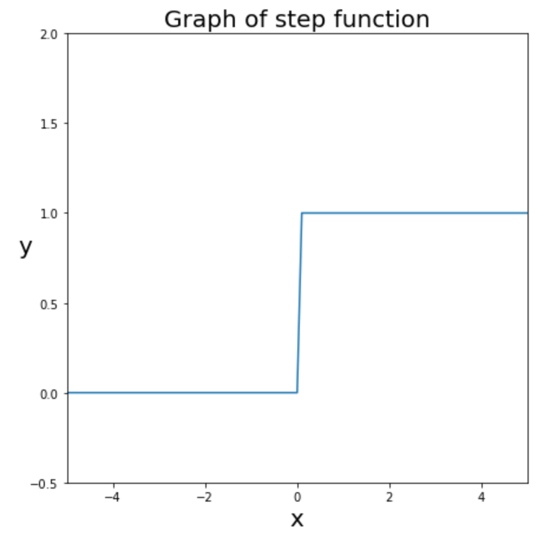

# 계단함수(Step_function)

$$h(x) = \begin{cases}
0 \\ (x\leq0) \\
1 \\ (x>0)
\end{cases}$$

```python

# 계단함수 1
def step_function_one(x):
    if x <= 0:
        return 0
    elif x > 0 :
        return 1

# 계단함수 2
def step_function_two(x):
    y = x > 0
    return y.astype(np.int)
```

- 이 코드는 만약 x가 0 이하이면 0을 반환하고, 0 초과이면 1을 반환하는 코드이다.
- x.astype(np.int)는 데이터 x를 정수(int)타입으로 바꿔달라는 의미이다.
- False는 0, True 1이므로 step_function_one과 같은 기능을 한다.

```python

# 계단함수를 그리기
import numpy as np
import matplotlib.pyplot as plt

np.arange(-6.0, 6.0, 0.1)
y = step_function_two(x)

# 캔버스 설정
fig = plt.figure(figsize=(7,7))  # 캔버스 생성
fig.set_facecolor('white')

plt.plot(x, y)
plt.ylim(-0.5, 2)
plt.xlim(-5, 5)
plt.ylabel('y', fontsize=20, rotation=0)
plt.xlabel('x', fontsize=20)
plt.title('Graph of step function', fontsize=20)

plt.show()
```
## 코드 결과



- 위에 있는 그래프를 보면 마치 계단을 올라가듯이, x가 0을 기준으로 크게 변하는 것을 알 수 있다.
- 출력되는 결과값이 갖는 정보가 너무 희석된다는 단점이 있다.
- 예를 들어서 합산된 값이 0.1인 경우와 1.0인 경우는 단순 산술적으로 10배 정도 차이가 있으나, 이를 모두 무시하고 단순하게 1로 전달하므로, 합산된 값의 강도에 대한 의미가 부여되지 않는다.