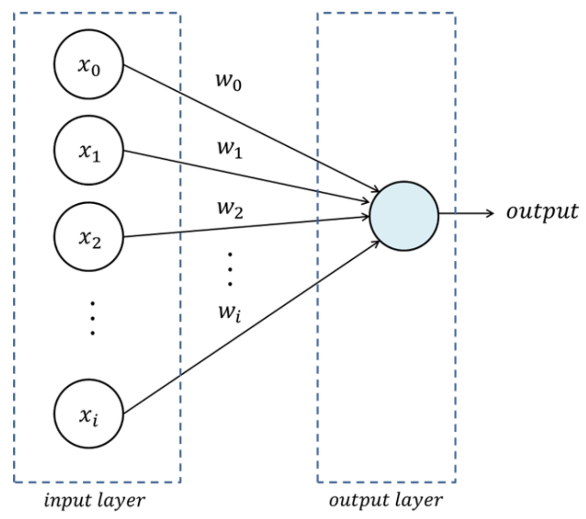
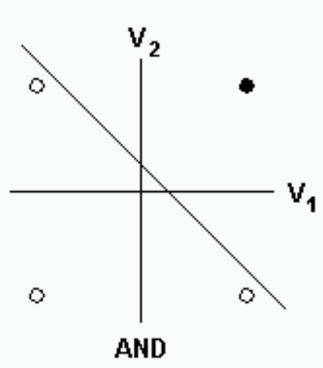
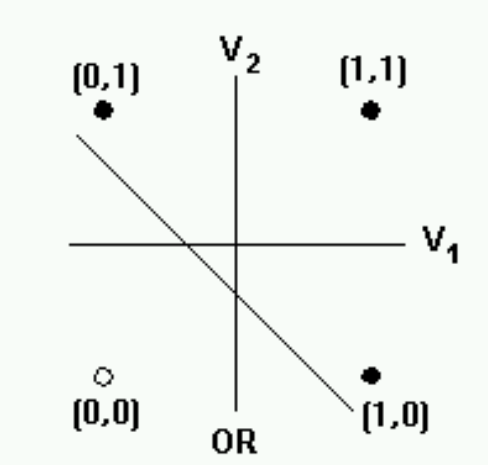
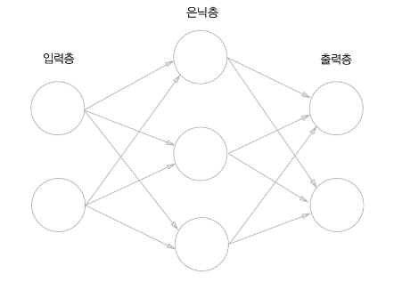
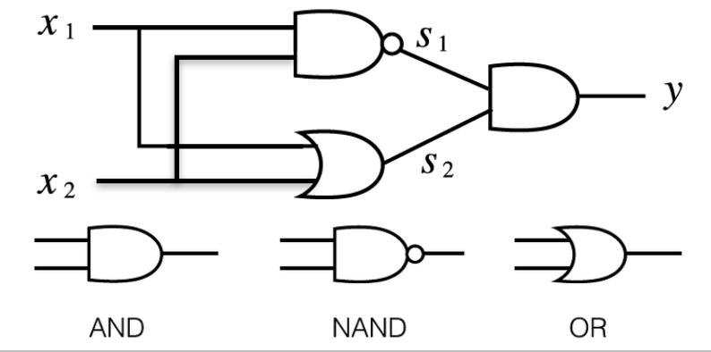

# 1. Deep Learning
## 1. Perceptron(퍼셉트론)
- 다수의 input을 받아 두 분류의 output을 출력하는 구조
- 여러 입력값(input)값들에 대해 0 또는 1로 출력하는 함수
- 여러 이진 분류를 구현해 낼 수 있다.

## 2. Single Layer Perceptron(단층 퍼셉트론)
- 뉴런을 본따서 만든 알고리즘 하나의 단위

- 단층 Perceptron으로 AND, OR문제는 해결이 가능하나, XOR문제는 해결이 불가능하다.
---
- AND 게이트
- input(x1, x2)값 둘 다 1이면 y=1인 게이트

|x1|x2|AND(x1, x2)|
|:------:|:------:|:------:|
|0|0|0|
|0|1|0|
|1|0|0|
|1|1|1|
---
- OR 게이트
- input(x1, x2)값 중 하나만 1이면 y=1인 게이트

|x1|x2|OR(x1, x2)|
|:------:|:------:|:------:|
|0|0|0|
|0|1|1|
|1|0|1|
|1|1|1|
---

## 2. Multi-layer Perceptron(다층 퍼셉트론)
- 복수의 Perceptron을 연결한 구조
- 퍼셉트론(Perceptron)을 층으로 쌓은 것으로, 입력층과 출력층 사이에 은닉층이 존재하는 것

- Multi layer perceptron(다층 퍼셉트론: AND, NAND, OR 조합)으로 XOR 게이트를 구현할 수 있다.

  
|$x_1$|$x_2$|AND|NAND|OR|XOR|
|:------:|:------:|:------:|:------:|:------:|:------:|
|0|0|0|1|0|0|
|0|1|1|0|1|1|
|1|0|1|0|1|1|
|1|1|1|0|1|0|
---

### 1. 넘겨져 온 데이터와 $\theta$들의 Linear combination을 계산(합과 곱)
- $\theta_0$ + $\theta_1x_1$ + $\theta_2x_2$ + $\cdots$ + $\theta_nx_n$

### 2. 선형결합의 결과에 `Activation function(활성화 함수)을 적용`
#### 1. `Activation function(활성화함수)`
- 이전 레이어의 모든 일력에 대한 가중 합을 받아 `출력 값을 생성하여 다음 레이어로 전달하는 비선형 함수`
- Linear combination의 결과값이 Non-linear Function을 거치게 하여 최종 출력값을 계산
- 다음 layer로 얼마나 넘겨줄지 결정한다.
- $\theta_0$ + $\theta_1x_1$ + $\theta_2x_2$ + $\cdots$ + $\theta_nx_n$ = $\displaystyle\sum_{i}\theta_ix_i$
- $g(\displaystyle\sum_{i}\theta_ix_i)$
- 결론적으로 가장 적합한 $\theta$(Theta)들의 set을 찾아야 한다.
- 대표적인 Activation functions : `Step`, `Sigmoid`, `Hyperbolic Tangent(tanh)`, `Rectified Lenear Unit(ReLu)`

