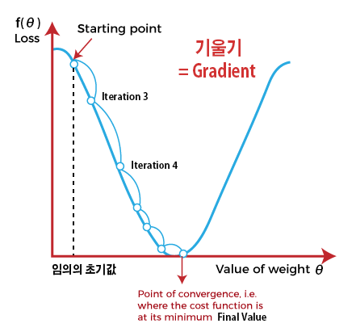

# Neural Network Optimization method (신경망 최적화 방법)

# 1. 가중치 초기화(Weight lnitialization)

- Gradient Descent(경사 하강법)를 적용하기 위한 첫 단계는 모든 $\theta$를 초기화하는 것이다.
- 초기화 시점의 작은 차이가 학습의 결과를 뒤바뀔 수 있으므로 보다 나은 초기화 방식을 모색할 수 있다.

---
- `Perceptron의 선형결합(Linear combination)결과값(=활성화 함수(Activation function으로의 입력값)이 너무 커지거나 작아지지 않게 만들어지는 것이 핵심`이다.

## 1. Use Xavier(자비에 or 이그재비어 or 세이비어) lnitialization
- 활성화 함수(Activation function)로 `시그모이드 함수(Sigmoid function)`나 `탄 함수(tanh function)`를 사용할 때 사용한다.
- 다수의 딥러닝 라이브러리에 `Default로 적용`되어 있다.
- 표준편차가 $\sqrt\frac{1}{n}$인 정규분포를 따르도록 가중치를 초기화한다.
- 여기서 $n$은 # of nodes of previous layer(이전 레이어의 노드 수)를 의미한다.

## 2. He Initialization
- 활성화 함수(Activation function)가 `ReLU함수`일 때 적용한다.
- 표준편차가 $\sqrt\frac{2}{n}$인 정규분포를 따르도록 가중치를 초기화한다.

