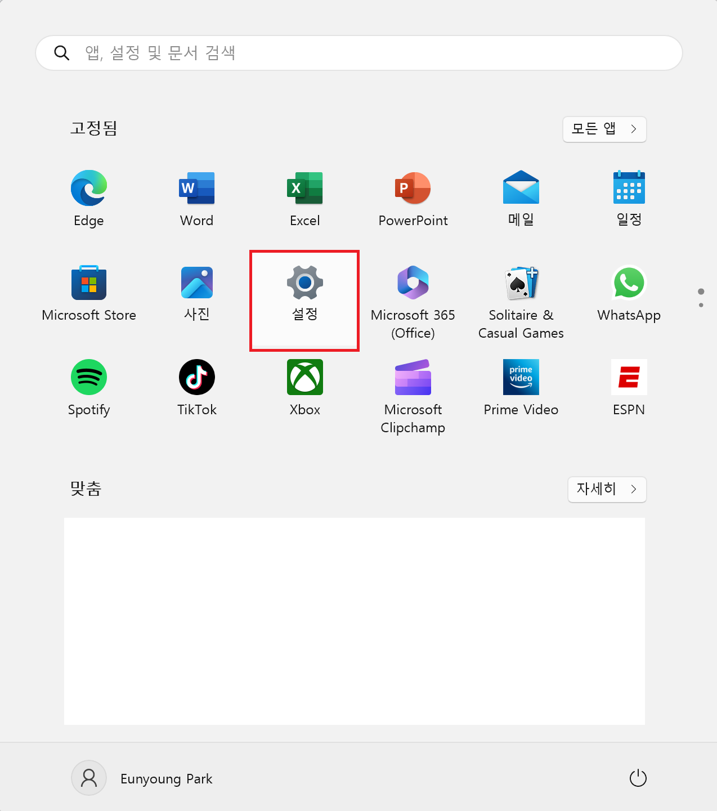
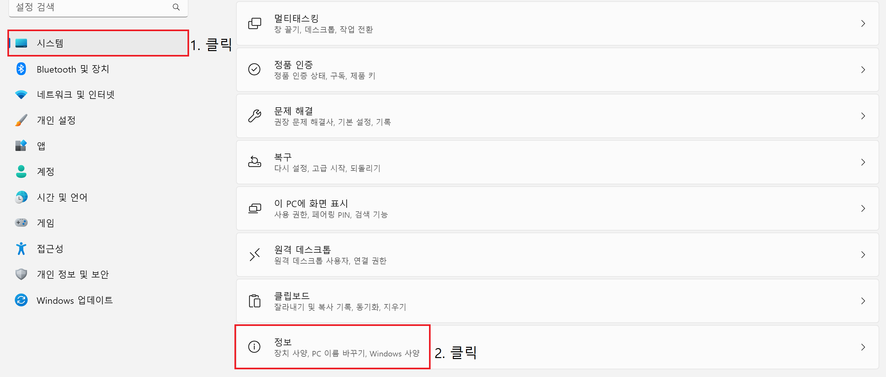
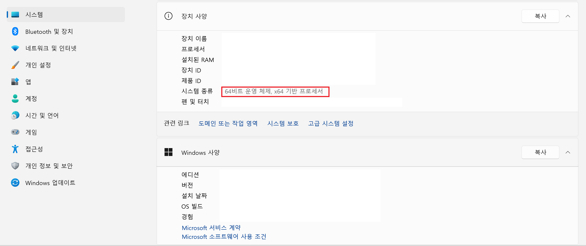
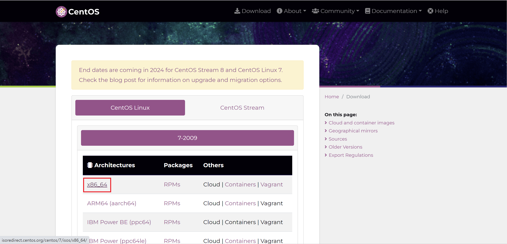
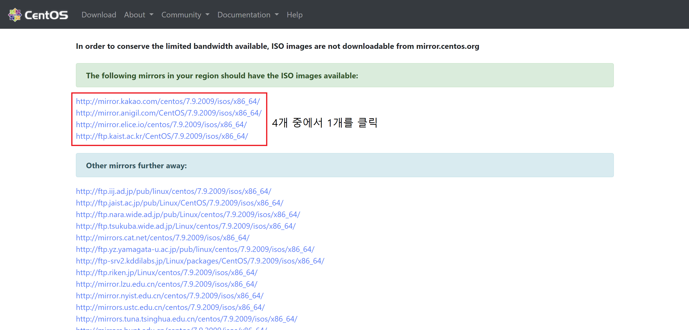
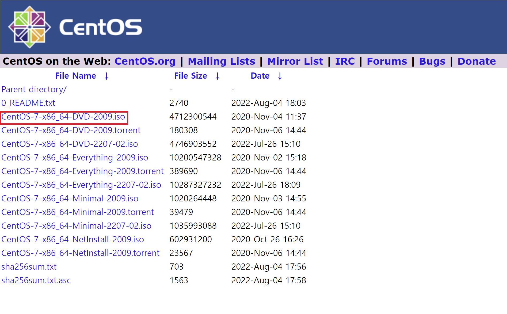

# 01. CentOS7 설치

## 01. CentOS 사이트 https://www.centos.org에 접속해서 Download를 클릭한다.

## 02. 자신의 컴퓨터에 맞는 운영체제를 확인한다. 먼저 시작을 클릭한 후, 설정으로 들어간다.(Windows11 기준이지만 Windows10하고 같다.)

## 03. 시스템을 클릭한 후, 오른쪽 화살표를 맨 아래로 내리면 정보가 있다. 그것을 클릭한다.

## 04. 시스템 종류에 자신의 운영체제가 나온다. 예를 들면 64비트 운영체제, x64 기반 프로세서라고 써 있다.

## 05. 만약에 자신의 운영체제가 64비트 운영체제라면 CentOS사이트에서 x86_64라고 써 있는 것을 클릭한다. 참고로 32비트 운영체제라면 x86을 다운로드 받아야 한다.(거의 오래된 컴퓨터가 여기에 속한다.)

## 06. The following mirrors in your region should have the ISO images available: 라고 써 있는 곳에서 아래에 있는 4개 중 1개를 클릭한다.

## 07. 세 번째에 있는 CentOS-7-x86_64-DVD-2009.iso 파일을 다운로드를 한다.

## 08. 가상머신을 만들기 위해서 Oracle VM VirtualBox 사이트인 https://www.virtualbox.org 에 접속한다

